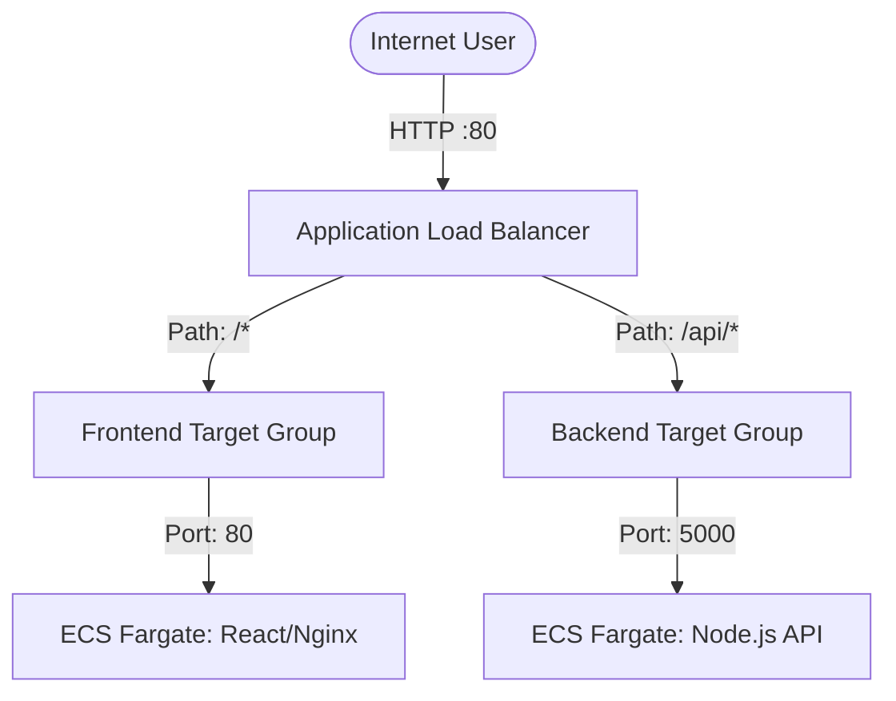

# Stage 1.4: Application Load Balancer (ALB)

## Goal
Provide a single, highly-available public entry point for our application that securely routes traffic to the correct containers (Frontend vs. Backend) while continuously monitoring their health.

## Core Concepts

* **Application Load Balancer (ALB):** Sits in the public subnets. It receives HTTP requests from the internet and decides where to send them based on rules.
* **Listeners:** The "ears" of the load balancer. We configured a listener on Port 80 (HTTP) to listen for incoming traffic.
* **Target Groups:** The destination groups. We created two:
  * **Frontend Target Group (Port 80)**
  * **Backend Target Group (Port 5000)**
* **Routing Rules:** 
  * If the URL path starts with `/api/*`, the ALB routes the traffic to the **Backend** Target Group.
  * For everything else (default action), it routes traffic to the **Frontend** Target Group.
* **Health Checks:** The ALB acts like a real user, constantly pinging the containers (every 30 seconds). If a container fails to respond with a `200 OK` status, the ALB stops sending traffic to it until it recovers.

## Architecture Flow

## 🚨 Key Learnings: Docker Compose vs. AWS ECS Networking

During this stage, we discovered a major difference in how networking works locally vs. in the cloud.

* **Locally (`docker-compose.yml`):** We mapped ports from our laptop to the container using `3000:80`. Our laptop acted as a middleman.
* **AWS ECS (Fargate `awsvpc` mode):** There is no "host" middleman. The ALB talks directly to the IP address of the container. 
* **The Fix:** Because our Frontend Dockerfile uses Nginx (`EXPOSE 80`) and our Backend uses Node (`EXPOSE 5000`), we had to ensure our ALB Target Groups and Security Groups matched the **internal container ports** (80 and 5000), completely ignoring the local 3000 port.

## Outputs
We exposed critical ALB information in `outputs.tf`:
* **DNS Name:** The temporary URL to access the application before setting up Route 53.
* **Zone ID:** Required for future custom domain name alias records.
* **Target Group ARNs:** Required for the upcoming ECS module so it knows exactly where to register new containers when they boot up.
