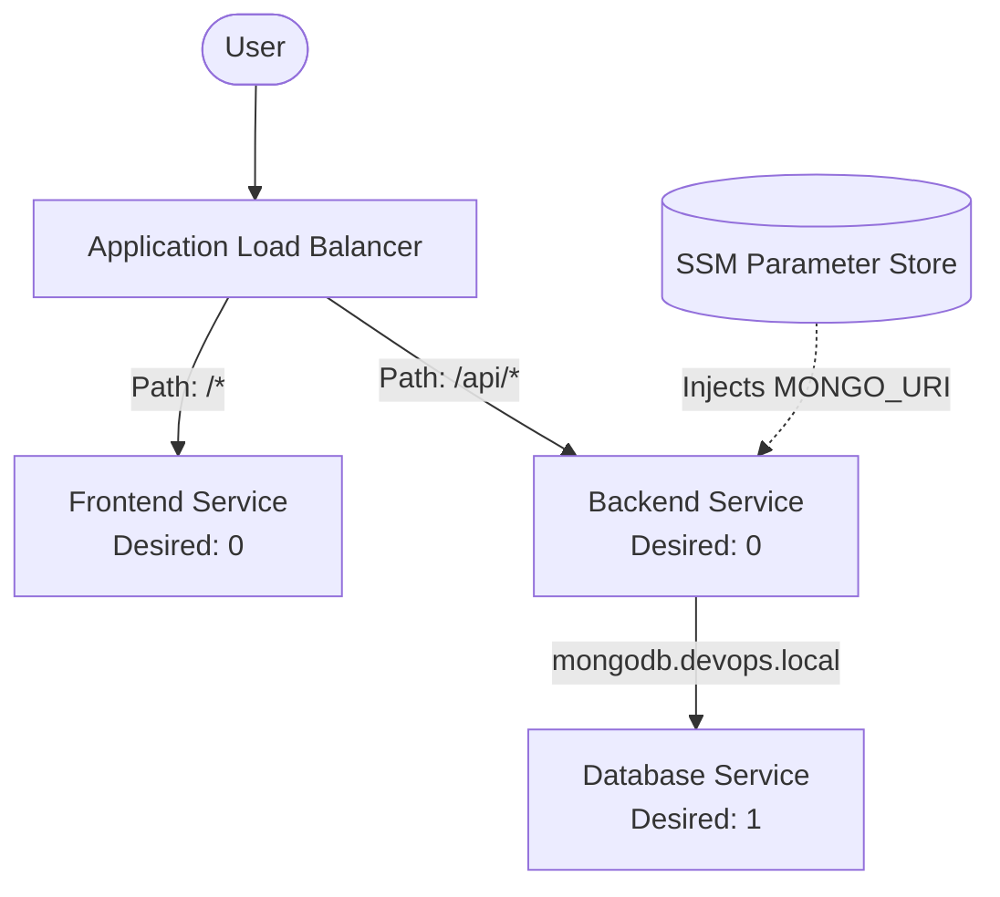

# Stage 1.7: Elastic Container Service (ECS) & Secrets Management

## Goal
Deploy our MERN stack into a highly scalable, serverless environment using AWS Fargate, while ensuring sensitive data is handled securely using AWS Systems Manager (SSM) Parameter Store.

## Core Concepts

* **ECS Cluster:** A logical grouping boundary for our containers. 
* **Task Definitions:** The AWS equivalent of a `docker-compose.yml` service block. It dictates the CPU, RAM, Docker image, ports, and environment variables for a container.
* **ECS Service:** The manager that takes the blueprint (Task Definition) and ensures a specific number of copies (`desired_count`) are running and attached to the Load Balancer.
* **AWS Fargate:** The serverless compute engine for ECS. We do not manage, patch, or SSH into any underlying EC2 servers.

## 🚨 Key Learnings & "Aha!" Moments

### 1. Service Discovery (AWS Cloud Map) vs. Docker DNS
In `docker-compose`, containers find each other simply by using their service names (e.g., `mongodb://mongodb:27017`). In AWS Fargate, container IP addresses are dynamic. We solved this by using **AWS Cloud Map (Service Discovery)** to create a private internal DNS namespace (`devops.local`). This allows our backend to consistently reach the database at `mongodb.devops.local` regardless of container restarts.

### 2. Secrets vs. Environment Variables
Hardcoding sensitive data (like database connection strings) into Terraform or Git is a massive security risk. 
* **The Fix:** We created an **SSM Parameter Store** SecureString. 
* Instead of passing it via the plaintext `environment` array, we used the ECS `secrets` array. At boot, the ECS agent assumes the Task Execution Role, decrypts the secret from SSM, and safely injects it directly into the running Node.js memory.

### 3. The "Empty ECR" Problem
Because our Terraform code executes *before* our GitHub Actions pipeline has built and pushed the Docker images to ECR, the ECR repositories are empty.
* **The Fix:** We set `desired_count = 0` for our App services. This creates the infrastructure "slots" for our containers but prevents Terraform from getting stuck in an infinite loop waiting for images that don't exist yet. The CI/CD pipeline will increase this count to 1.

### 4. Client-Side vs Server-Side Environment Variables
* **Server-Side (Node.js):** ECS injects variables at *runtime* because Node runs actively on the AWS server.
* **Client-Side (React/Vite):** React compiles to static HTML/JS files served to the user's browser. It cannot read ECS environment variables at runtime. Instead, the `API_BASE_URL` must be injected at *build-time* via GitHub Actions (`docker build --build-arg`).

## Architecture Flow

